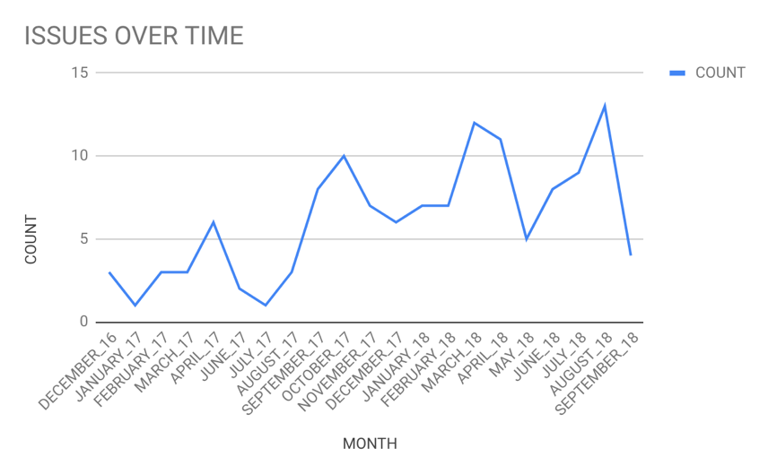
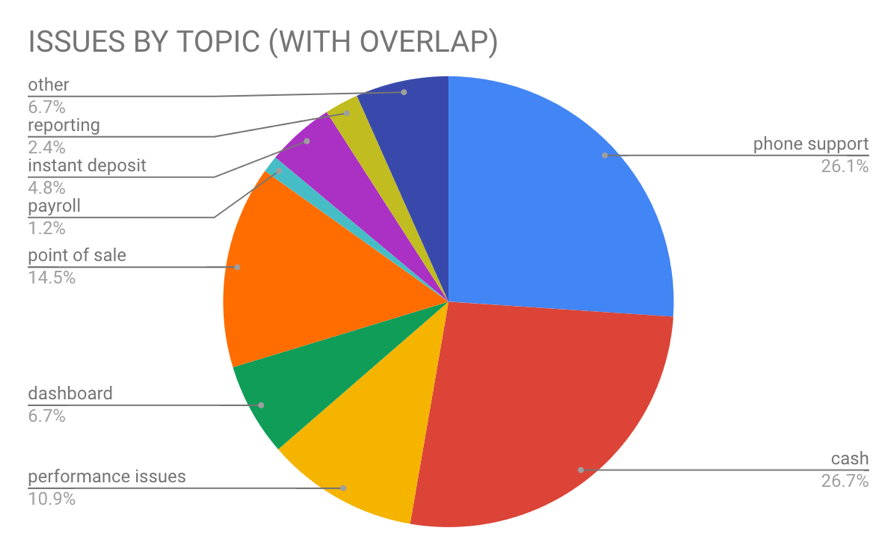

# Analysis of Square's Reliability History

`code`: relevant files for scraping data
`square issues`: aggregated data via spreadsheet
`square project`: overview of this project and its findings

## Overview
#### Objective
Analyze Square’s [reported] status updates + issues

#### Approach
Initially, I took a look at the site https://www.issquareup.com/history in Postman (via ‘GET’ request) and Google Chrome, and tinkered around within the dev console to see the composition of the website. Having noticed there were multiple pages, I thought it would be more efficient to extract data by writing a script that would automatically navigate to the next page (via baseURL + ‘?page=XX’). Thus, I set off to scrape using Cheerio at first. However, I ran into a roadblock as I could not easily use a query selector to find incidents (based on their class, ‘incident-title’). 

After finding most of the site data in a ‘data-react-props’ attribute, I thought this issue could be attributed to delays in rendering. As a result, I explored other JavaScript tools such as PhantomJS, Selenium, and slightly less common tools such as Puppeteer and ScraperJS. I used Selenium and introduced a timeout/delay to try to capture site details after they would have loaded in the headless browser. This approach, too, led to the result of using Cheerio: a large HTML dump, with data stored in a ‘data-react-props’ attribute and not elsewhere.  

These efforts were generally fruitless, and having noticed there were only 8 pages of results, I determined it would be more effective to simply write a script that I would execute on each results page. 

The script (chromeScript.js) would:
1.	Emulate button clicks to expand all sections (so that all incidents are visible)
2.	Get the title, date, and body of each incident
3.	Create an array of all incidents within a month
4.	Create a mapping from month to an array of its incidents
5.	Print aforementioned map via JSON.stringify()

Then, I would copy and paste the results into a JSON file (incidents.json) that I was maintaining to store all months’ data. I repeated this process for each page. Upon completion, I cleaned up the data, and parsed (jsonParser.js) the JSON file (incidents.json) to analyze how the issues were distributed by topic. Then, I simply loaded all the data onto sheet (Square Issues.xlsx) and created the graphics in the following section.

#### Results

The charts above portray the frequency of issues over time and the distribution of issues by topic, respectively. “WITH OVERLAP” simply means that if a single incident involved both Cash (i.e. Cash App or Cash Card) and Point of Sale, the counts for Cash and Point of Sale would both increase by 1.  

#### Conclusion
This analysis suggests that problems regarding Cash and Phone Support comprise the lion’s share of Square’s exhibited performance issues. Further work would depict the frequency of specific issues over time to potentially extrapolate overall reliability trends. 

Reflecting on my approach, I would love to see how I could’ve done this using the aforementioned scraping tools such as Cheerio or Phantom, as I am confident that there are methods that would have worked. However, given limited time and resources, I think my decision to scrape via Chrome dev console was ultimately effective given my objective.
